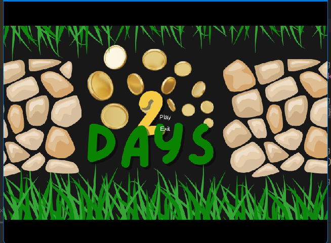
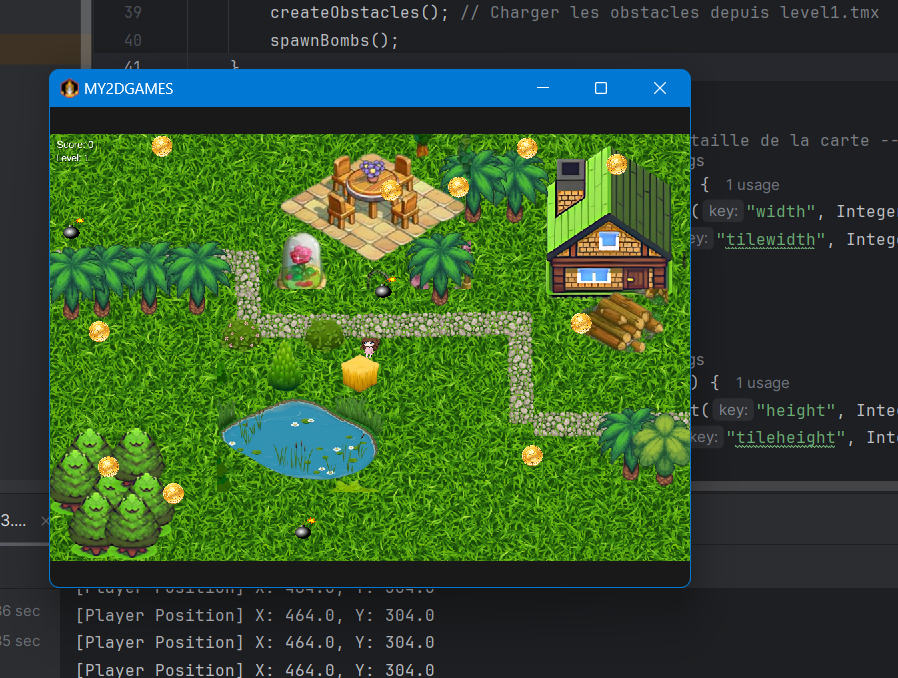

# 🎮 2Days – Jeu 2D avec LibGDX

> 👩🏽‍💻 Projet de fin d’études – Université Sidi Mohamed Ben Abdellah (2024)  
> ✨ Réalisé par : **Abibatou NDIAYE** & **Fania TAHAR ABDALLAH**

---

## 📌 Présentation

**2Days** est un jeu vidéo en 2D développé en Java avec le framework **LibGDX**.  
Le joueur incarne un personnage qui doit collecter des pièces tout en évitant des **bombes mortelles** et des **obstacles**.  
Une collision avec une bombe entraîne une défaite immédiate.

Ce projet a été conçu dans un but pédagogique afin d’apprendre à développer un moteur de jeu extensible, structuré selon le modèle **MVC**, tout en exploitant des outils modernes comme **Tiled**.

---

## 🎯 Objectifs pédagogiques

- Concevoir un **moteur de jeu 2D extensible**
- Créer des niveaux dynamiques avec **Tiled**
- Implémenter une interface utilisateur complète (menu, transitions, Game Over)
- Gérer les collisions, le score et la progression dans le jeu
- Faciliter l’ajout de contenus sans modifier le code source

---

## 🧰 Technologies utilisées

| Outil / Technologie | Rôle |
|---------------------|------|
| [Java 8+](https://www.oracle.com/java/) | Langage de développement |
| [LibGDX](https://libgdx.com) | Moteur de jeu 2D |
| [Tiled](https://www.mapeditor.org/) | Conception des cartes (.tmx) |
| IntelliJ IDEA | IDE de développement |
| Gradle | Gestionnaire de build |
| Git / GitHub | Versioning & travail collaboratif |

---

## 🔍 Fonctionnalités principales

- 🎮 **Contrôle du joueur** via les touches fléchées
- 💥 **Gestion des bombes** (collision = Game Over)
- 🪙 **Collecte des pièces** (score et progression)
- 🧱 **Obstacles configurés dans Tiled**
- 📈 **Transitions dynamiques entre les niveaux**
- 🧩 **Interface utilisateur immersive** (menus, transitions, écran de fin)
- 📦 **Chargement automatique des cartes et objets via fichiers `.tmx`**

---

## 📸 Captures d’écran

### Menu principal  

### Écran de jeu  

### Prototype initial  

> 📁 Les images sont stockées dans le dossier `captures/`.

---

## 🎥 Démonstration vidéo

📺 [Clique ici pour voir la démo sur YouTube](https://LIEN_VERS_LA_VIDEO)

---

## 📁 Structure du projet
2DGAMES/
├── assets/             # Cartes, images, sons
├── core/               # Code source principal
│   └── src/...         # Écrans, logique, entités
├── lwjgl3/             # Lancement desktop
├── captures/           # Captures d’écran
├── build.gradle        # Fichier de configuration Gradle
├── README.md           # Ce fichier
└── ...
---

## 🎓 Projet réalisé avec passion et esprit d’équipe ❤️
